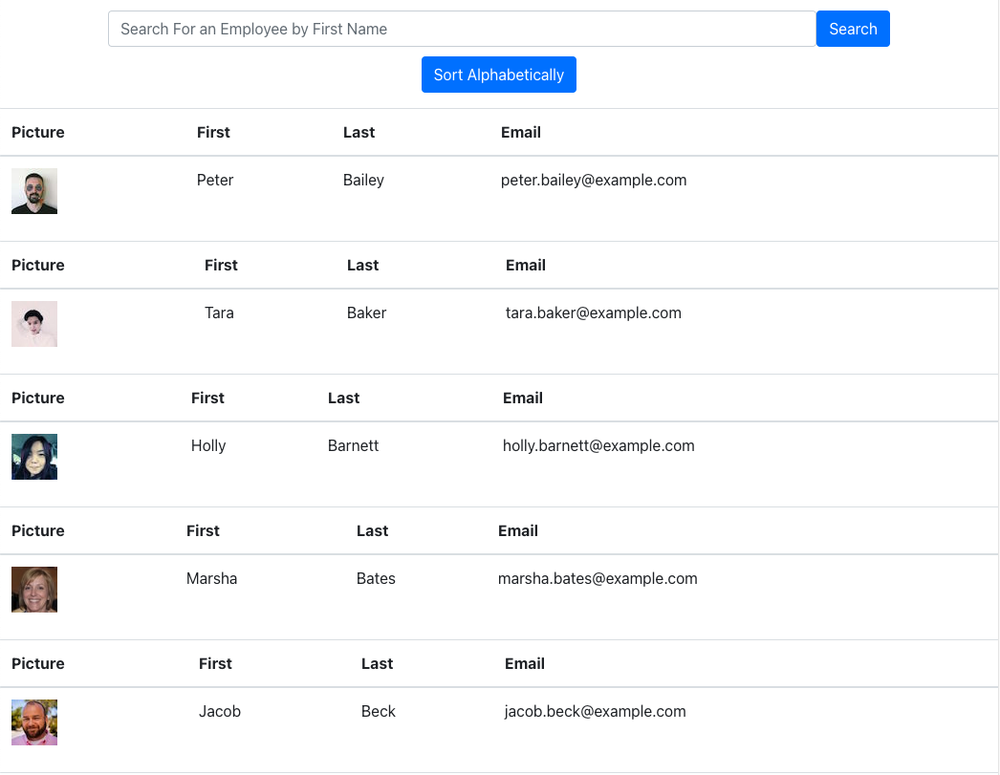

# User-Directory

## What, Why, and HOW
With this assignment, I was motivated to use my new skills with React in order to both call on an API, and to then be able to filter and sort the data from that API. It was really difficult. I've always considered myself to be much stronger at front end than at back end, but React has proven to be a little bit tricky. At the same time, working through this assignment has shown me that (while there is definitely a learning curve) once you put some time in with React and really work hard to understand all the components, classes, etc., it starts to come together and make sense. The result is an application that generates 50 random employees onto a page, and which has the ability to search employees by first name, as well as to sort alphabetically by last name.  
To achieve the end result, I:
1. Created a new react app 
2. Pseudo coded so that I knew how to set up my files/folders
3. Created all the components that had the basic JSX inside of them
4. Created the "People" component, which contained the class and which brought together all the other components in order to render the content 

The assignment was really difficult. In order to complete it, I found myself spending hours going back through previous activities and asking my peers questions. Although I'm proud of the final product, I know that I still have a long way to go with React.  

# Links
Link to GitHub repo: https://github.com/andrew1835/user-directory
 
Link to deployed application: https://mighty-eyrie-87189.herokuapp.com/

# Screenshot
This screenshot shows what the application looks like once the "Sort Alphabetically" button has been clicked

